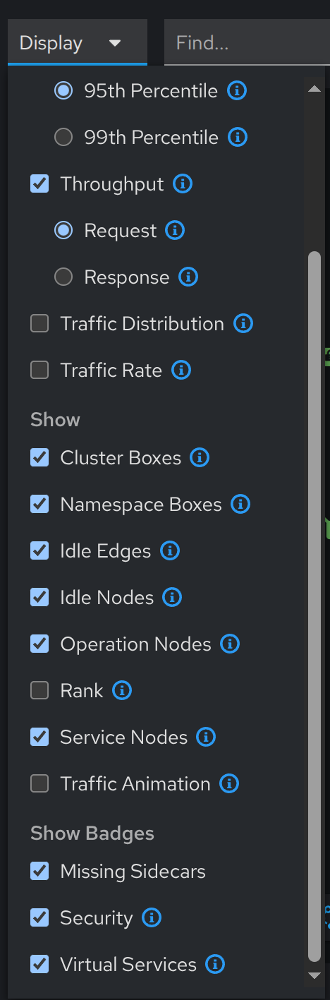

# Tutorial 

## Background 

Over 20+ years in my industry, I've worked on and managed several mission-critical systems. Many suffer from fundamental issues that impact support, maintenance, evolvability, and general development. The root cause, in my opinion, is the lack of ground truth about the actual system architecture running in production. Instead, teams of developers and their leadership carry half-formed models in their heads and rely on occasional documentation that's often stale. As a result, everything suffers:

* New developers cannot form an accurate understanding of the system quickly. This delays their empowerment to become useful in the team.
* Misunderstanding of how the system is wired together delays the mean time to recovery from production issues. These misunderstandings have even resulted in human error and further production issues.
* Information for system performance, traffic analysis, and other metrics are spread across multiple monitoring and reporting systems, increasing the time it takes to diagnose the cause of an unhealthy system.
* System architecture decisions can become protracted and error prone.

It doesn't have to be this way. Modern observability tools can solve these problems elegantly, and it's now relatively easy to set up systems for observability. In this tutorial, I'm going to show one way of doing this using a local Kubernetes cluster via [kind](https://kind.sigs.k8s.io/), along with [Istio](https://istio.io/) and [Kiali](https://kiali.io/).


## Tutorial 

This tutorial will guide you through every step needed to:
- Create a local Kubernetes cluster using kind
- Install Istio and all required observability tools
- Deploy the BookInfo sample app
- Generate traffic and visualize service dependencies in Kiali

## Screen Cast

[screencast.webm](https://github.com/user-attachments/assets/6d9dc7c9-809d-41eb-bde5-abac5812653d)

## Prerequisites & Installation
This guide assumes a Linux system. If you are missing any tools, follow these steps:

### 1. Install Docker
Follow the official instructions: https://docs.docker.com/engine/install/
Or, for Ubuntu:
```sh
sudo apt-get update
sudo apt-get install -y docker.io
sudo systemctl enable --now docker
sudo usermod -aG docker $USER
```
Log out and back in for group changes to take effect.

### 2. Install kubectl
```sh
curl -LO "https://dl.k8s.io/release/$(curl -L -s https://dl.k8s.io/release/stable.txt)/bin/linux/amd64/kubectl"
sudo install -o root -g root -m 0755 kubectl /usr/local/bin/kubectl
rm kubectl
```

### 3. Install kind
```sh
curl -Lo ./kind "https://kind.sigs.k8s.io/dl/v0.23.0/kind-linux-amd64"
chmod +x ./kind
sudo mv ./kind /usr/local/bin/kind
```

### 4. Install istioctl
```sh
curl -L https://istio.io/downloadIstio | sh -
cd istio-*
sudo cp bin/istioctl /usr/local/bin/
cd ..
```

---

## 1. Create a kind Cluster
Creates a local Kubernetes cluster named `istio-demo` using kind.
```sh
kind create cluster --name istio-demo
```

You should see this output:

```sh
Creating cluster "istio-demo" ...
 ✓ Ensuring node image (kindest/node:v1.33.1) 🖼
 ✓ Preparing nodes 📦  
 ✓ Writing configuration 📜 
 ✓ Starting control-plane 🕹️ 
 ✓ Installing CNI 🔌 
 ✓ Installing StorageClass 💾 
Set kubectl context to "kind-istio-demo"
You can now use your cluster with:

kubectl cluster-info --context kind-istio-demo

Thanks for using kind! 😊
```

---

## 2. Install Istio
Installs Istio with the demo profile and enables automatic sidecar injection in the default namespace.
```sh
istioctl install --set profile=demo -y
kubectl label namespace default istio-injection=enabled
```

You should see: 

```sh
        |\          
        | \         
        |  \        
        |   \       
      /||    \      
     / ||     \     
    /  ||      \    
   /   ||       \   
  /    ||        \  
 /     ||         \ 
/______||__________\
____________________
  \__       _____/  
     \_____/        

✔ Istio core installed ⛵️                                                                                                                  
✔ Istiod installed 🧠                                                                                                                      
✔ Egress gateways installed 🛫                                                                                                             
✔ Ingress gateways installed 🛬                                                                                                            
✔ Installation complete  
```

```sh
kubectl label namespace default istio-injection=enabled
namespace/default labeled
```

---

## 3. Deploy the BookInfo Sample App
Deploys the BookInfo microservices demo application to your cluster.
```sh
kubectl apply -f https://raw.githubusercontent.com/istio/istio/release-1.26/samples/bookinfo/platform/kube/bookinfo.yaml
```

Which should give:

```sh
service/details created
serviceaccount/bookinfo-details created
deployment.apps/details-v1 created
service/ratings created
serviceaccount/bookinfo-ratings created
deployment.apps/ratings-v1 created
service/reviews created
serviceaccount/bookinfo-reviews created
deployment.apps/reviews-v1 created
deployment.apps/reviews-v2 created
deployment.apps/reviews-v3 created
service/productpage created
serviceaccount/bookinfo-productpage created
deployment.apps/productpage-v1 created
```

---

## 4. Verify the Deployment
Check that all BookInfo services and pods are running and ready.
```sh
kubectl get services
kubectl get pods
kubectl wait --for=condition=Ready pods --all --timeout=180s
```

```sh
NAME          TYPE        CLUSTER-IP      EXTERNAL-IP   PORT(S)    AGE
details       ClusterIP   10.96.98.57     <none>        9080/TCP   32s
kubernetes    ClusterIP   10.96.0.1       <none>        443/TCP    50m
productpage   ClusterIP   10.96.72.165    <none>        9080/TCP   32s
ratings       ClusterIP   10.96.135.201   <none>        9080/TCP   32s
reviews       ClusterIP   10.96.199.239   <none>        9080/TCP   32s

NAME                              READY   STATUS            RESTARTS   AGE
details-v1-766844796b-lp6t2       0/2     PodInitializing   0          32s
productpage-v1-54bb874995-5rtmz   0/2     PodInitializing   0          32s
ratings-v1-5dc79b6bcd-lnsd7       2/2     Running           0          32s
reviews-v1-598b896c9d-rt4zx       2/2     Running           0          32s
reviews-v2-556d6457d-87dbb        0/2     PodInitializing   0          32s
reviews-v3-564544b4d6-j8958       2/2     Running           0          32s

pod/details-v1-766844796b-lp6t2 condition met
pod/productpage-v1-54bb874995-5rtmz condition met
pod/ratings-v1-5dc79b6bcd-lnsd7 condition met
pod/reviews-v1-598b896c9d-rt4zx condition met
pod/reviews-v2-556d6457d-87dbb condition met
pod/reviews-v3-564544b4d6-j8958 condition met
```

---

## 5. Install Observability Addons
Kiali (for service graph) and Prometheus (for metrics) are required for full visualization.
```sh
kubectl apply -f https://raw.githubusercontent.com/istio/istio/release-1.26/samples/addons/kiali.yaml
kubectl apply -f https://raw.githubusercontent.com/istio/istio/release-1.26/samples/addons/prometheus.yaml
```

Wait for the pods to be ready:
```sh
kubectl wait --for=condition=Ready pods -l app=kiali -n istio-system --timeout=120s
kubectl wait --for=condition=Ready pods -l app=prometheus -n istio-system --timeout=120s
```

---

## 6. Access the Kiali Dashboard
Port-forward the Kiali service and open the dashboard in your browser.

```sh
kubectl port-forward svc/kiali -n istio-system 20001:20001 &
```

Then open [http://localhost:20001/kiali](http://localhost:20001/kiali) in your browser. (Default login is usually `admin/admin` or no login required.)


---

## 7. Generate Traffic for BookInfo

Kiali visualizes service dependencies based on real traffic. To generate traffic:

### Option 1: Manual (Browser)
Port-forward the productpage service and visit it in your browser:

```sh
kubectl port-forward svc/productpage 9080:9080 &
```

Open [http://localhost:9080/productpage](http://localhost:9080/productpage) and refresh the page several times.

)

### Option 2: Automated (Terminal)

Run this command to continuously generate traffic:
```sh
while true; do curl -s http://localhost:9080/productpage > /dev/null; sleep 1; done
```

After a minute or two, check the Kiali Traffic Graph for a live view of service interactions.

To view the graph, click on the "Traffic Graph" in the navbar on the left. 


I usually click in the "Display" drop down and select options to show more information:



## Exploring the Kiali Console

So, what can you do in the Kiali console?

* Visualise your service mesh as a live traffic graph—see how services talk to each other in real time.
* Drill into namespaces, applications, workloads, and services for detailed health and configuration info.
* Inspect Istio config (like VirtualServices, DestinationRules, etc.) and troubleshoot routing.
* Monitor traffic metrics, error rates, and request latencies.
* Access built-in dashboards for observability and quick debugging.
* Quickly spot issues with health indicators and alerts.
* 
In short: Kiali gives you a bird’s-eye view and deep dive tools for your Istio-powered microservices. It's quick and easy to understand the composition of your system and some of it's runtime characterists.

For further details, I recommend reading the respective documentation sites:

* [Kiali](https://kiali.io/docs/)
* [Istio](https://istio.io/latest/docs/)

---

## 8. Cleanup

Finally, to delete everything and free resources:

```sh
kind delete cluster --name istio-demo
```

## Conclusion

That’s it—you’ve now got a full local Kubernetes environment with Istio, BookInfo, and Kiali up and running. You can explore service dependencies, monitor traffic, and get hands-on with service mesh observability, all from your own machine. If you hit any snags or want to extend this setup, just tweak the configs or add more sample apps. Happy experimenting!

---

## Troubleshooting
- If Kiali shows errors about Prometheus, ensure Prometheus is installed and running in the `istio-system` namespace.
- If BookInfo pods are not ready, check pod logs for errors: `kubectl logs <pod-name>`
- For more details, see the [Istio BookInfo docs](https://istio.io/latest/docs/examples/bookinfo/).
